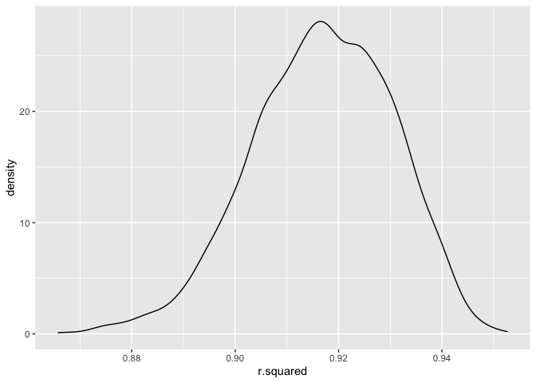
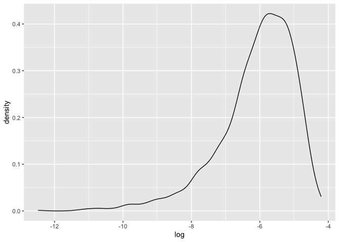

Homework 6
================
Selina Hsuan
2023-11-26

``` r
library(tidyverse)
```

    ## ── Attaching core tidyverse packages ──────────────────────── tidyverse 2.0.0 ──
    ## ✔ dplyr     1.1.3     ✔ readr     2.1.4
    ## ✔ forcats   1.0.0     ✔ stringr   1.5.0
    ## ✔ ggplot2   3.4.3     ✔ tibble    3.2.1
    ## ✔ lubridate 1.9.2     ✔ tidyr     1.3.0
    ## ✔ purrr     1.0.2     
    ## ── Conflicts ────────────────────────────────────────── tidyverse_conflicts() ──
    ## ✖ dplyr::filter() masks stats::filter()
    ## ✖ dplyr::lag()    masks stats::lag()
    ## ℹ Use the conflicted package (<http://conflicted.r-lib.org/>) to force all conflicts to become errors

``` r
set.seed(1)
```

## Problem 1

## Problem 2

Download data

``` r
weather_df = 
  rnoaa::meteo_pull_monitors(
    c("USW00094728"),
    var = c("PRCP", "TMIN", "TMAX"), 
    date_min = "2022-01-01",
    date_max = "2022-12-31") |>
  mutate(
    name = recode(id, USW00094728 = "CentralPark_NY"),
    tmin = tmin / 10,
    tmax = tmax / 10) |>
  select(name, id, everything())
```

    ## using cached file: /Users/selinahsuan/Library/Caches/org.R-project.R/R/rnoaa/noaa_ghcnd/USW00094728.dly

    ## date created (size, mb): 2023-09-29 12:37:37.942384 (8.525)

    ## file min/max dates: 1869-01-01 / 2023-09-30

create simple linear regression model

``` r
model = 
  weather_df |> 
  lm(tmax ~ tmin + prcp, data = _) |> 
  broom::glance() |> 
  select(r.squared)
```

``` r
weather_df |> 
  lm(tmax ~ tmin + prcp, data = _) |> 
  broom::tidy() |> 
  slice(c(2,3)) |> 
  select(term, estimate) |> 
  pivot_wider(
    names_from = term, values_from = estimate
    ) |> 
  mutate(log = ifelse(tmin > 0 & prcp > 0, log(tmin * prcp), NA))
```

    ## # A tibble: 1 × 3
    ##    tmin     prcp log  
    ##   <dbl>    <dbl> <lgl>
    ## 1  1.01 -0.00154 NA

create bootstrap function

``` r
boot_sample = function(df) {
  
  data = sample_frac(df, replace = TRUE)
  
  output1 = data |> 
    lm(tmax ~ tmin + prcp, data = _) |> 
    broom::glance() |> 
    select(r.squared)
  
  output2 = data |> 
  lm(tmax ~ tmin + prcp, data = _) |> 
  broom::tidy() |> 
  slice(c(2,3)) |> 
  select(term, estimate) |> 
  pivot_wider(
    names_from = term, values_from = estimate
    ) |> 
  mutate(log = ifelse(tmin > 0 & prcp > 0, log(tmin * prcp), NA)) |> 
  select(log)
  
  tibble(
    output1,
    output2
  )
}
```

draw many samples

``` r
boot_straps = 
  tibble(strap_number = 1:5000) |> 
  mutate(
    strap_sample = map(strap_number, \(i) boot_sample(weather_df))
  ) |> 
  unnest(strap_sample)
```

plot distribution of R square values

``` r
boot_straps |> 
  ggplot(aes(x = r.squared)) + 
  geom_density()
```

<!-- -->

plot distribution of log values

``` r
boot_straps |> 
  ggplot(aes(x = log)) + 
  geom_density()
```

    ## Warning: Removed 3361 rows containing non-finite values (`stat_density()`).

<!-- -->

calculate 95% confidence intervals

``` r
boot_straps |> 
  select(r.squared,log) |> 
  pivot_longer(
    cols = c(r.squared, log),
    names_to = "quantity", 
    values_to = "estimate"
  ) |> 
  group_by(quantity) |> 
  summarize(
    ci_lower = quantile(estimate, 0.025, na.rm = TRUE),
    ci_upper = quantile(estimate, 0.975, na.rm = TRUE))
```

    ## # A tibble: 2 × 3
    ##   quantity  ci_lower ci_upper
    ##   <chr>        <dbl>    <dbl>
    ## 1 log         -8.98    -4.60 
    ## 2 r.squared    0.889    0.941
